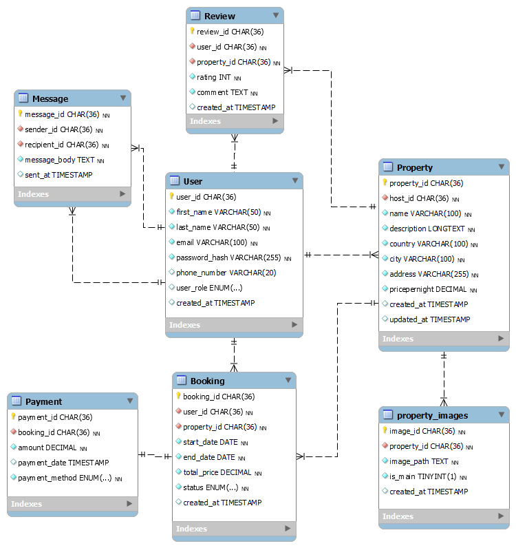

# Airbnb Clone ERD

This directory contains the **Entity Relationship Diagram (ERD)** for the Airbnb Clone database.
It outlines the tables, attributes, constraints, and relationships that define the project structure.

---

## Entities and Attributes

### **User**

* `user_id`: Primary Key, UUID, Indexed
* `first_name`: VARCHAR, **NOT NULL**
* `last_name`: VARCHAR, **NOT NULL**
* `email`: VARCHAR, **UNIQUE**, **NOT NULL**
* `password_hash`: VARCHAR, **NOT NULL**
* `phone_number`: VARCHAR, NULL
* `role`: ENUM (guest, host, admin), **NOT NULL**
* `created_at`: TIMESTAMP, **DEFAULT CURRENT_TIMESTAMP**

**Constraints:**

* Unique constraint on `email`
* Non-null constraints on required fields

---

### **Property**

* `property_id`: Primary Key, UUID, Indexed
* `host_id`: Foreign Key, references `User(user_id)`
* `name`: VARCHAR, **NOT NULL**
* `description`: TEXT, **NOT NULL**
* `country`: VARCHAR, **NOT NULL**
* `city`: VARCHAR, **NOT NULL**
* `address`: VARCHAR, **NOT NULL**
* `pricepernight`: DECIMAL, **NOT NULL**
* `created_at`: TIMESTAMP, **DEFAULT CURRENT_TIMESTAMP**
* `updated_at`: TIMESTAMP, **ON UPDATE CURRENT_TIMESTAMP**

**Constraints:**

* Foreign key on `host_id`
* Non-null constraints on essential attributes

---

### **Booking**

* `booking_id`: Primary Key, UUID, Indexed
* `property_id`: Foreign Key, references `Property(property_id)`
* `user_id`: Foreign Key, references `User(user_id)`
* `start_date`: DATE, **NOT NULL**
* `end_date`: DATE, **NOT NULL**
* `total_price`: DECIMAL, **NOT NULL**
* `status`: ENUM (pending, confirmed, canceled), **NOT NULL**
* `created_at`: TIMESTAMP, **DEFAULT CURRENT_TIMESTAMP**

**Constraints:**

* Foreign keys on `property_id` and `user_id`
* `status` restricted to ENUM values

---

### **Payment**

* `payment_id`: Primary Key, UUID, Indexed
* `booking_id`: Foreign Key, references `Booking(booking_id)`
* `amount`: DECIMAL, **NOT NULL**
* `payment_date`: TIMESTAMP, **DEFAULT CURRENT_TIMESTAMP**
* `payment_method`: ENUM (credit_card, paypal, stripe), **NOT NULL**

**Constraints:**

* Foreign key on `booking_id`
* Ensures payment linked to valid booking

---

### **Review**

* `review_id`: Primary Key, UUID, Indexed
* `property_id`: Foreign Key, references `Property(property_id)`
* `user_id`: Foreign Key, references `User(user_id)`
* `rating`: INTEGER, **CHECK (rating >= 1 AND rating <= 5)**, **NOT NULL**
* `comment`: TEXT, **NOT NULL**
* `created_at`: TIMESTAMP, **DEFAULT CURRENT_TIMESTAMP**

**Constraints:**

* Foreign keys on `property_id` and `user_id`
* Check constraint on `rating` (1–5)

---

### **Message**

* `message_id`: Primary Key, UUID, Indexed
* `sender_id`: Foreign Key, references `User(user_id)`
* `recipient_id`: Foreign Key, references `User(user_id)`
* `message_body`: TEXT, **NOT NULL**
* `sent_at`: TIMESTAMP, **DEFAULT CURRENT_TIMESTAMP**

**Constraints:**

* Foreign keys on `sender_id` and `recipient_id`

---

## Relationships

* **User-Property:** **one-to-many** — a user can have many properties listed, but a property has only one host (`Property.host_id → User.user_id`).
* **User-Booking:** **one-to-many** — a user can have multiple bookings; each booking belongs to one user (`Booking.user_id → User.user_id`).
* **User-Review:** **one-to-many** — a user can post many reviews; a review is posted by one user (`Review.user_id → User.user_id`).
* **User-Message:** **one-to-many (both ways)**

  * one user can **send many** messages (`Message.sender_id → User.user_id`)
  * one user can **receive many** messages (`Message.recipient_id → User.user_id`)
* **Property-Booking:** **one-to-many** — a property can be booked multiple times (`Booking.property_id → Property.property_id`).
* **Property-Review:** **one-to-many** — a property can have many reviews from many users (`Review.property_id → Property.property_id`).
* **Booking-Payment:** **one-to-one** — each booking links to a single payment (`Payment.booking_id → Booking.booking_id`).

---

## Indexing

* Primary keys: Indexed automatically
* Additional indexes on:

  * `User.email`
  * `Property.property_id`
  * `Booking.property_id`, `Booking.booking_id`
  * `Payment.booking_id`