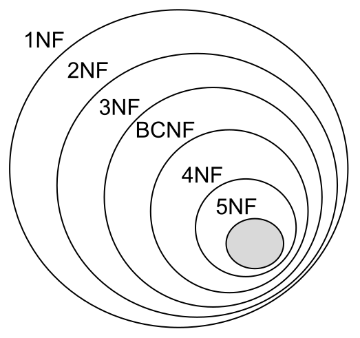

# Airbnb Clone Database Project

This repository contains the database design for an Airbnb clone, including ERD, normalization, SQL schema, and sample data.


## Normalization Summary

- **1NF:** Each column contains atomic values and no repeating groups
- **2NF:** Non-key attributes fully depend on primary keys  
- **3NF:** No transitive dependencies  
- **BCNF:** All determinants are keys  
- **4NF:** Each table describes one type of data  
- **5NF:** Tables cannot be reconstructed by joining smaller tables



## Repository Structure

```
alx-airbnb-database/
├─ ERD/
│  ├─ requirements.md
│  └─ airbnb_clone_project_ERD.png
├─ database-script-0x01/
│  ├─ schema.sql
│  └─ README.md
├─ database-script-0x02/
│  ├─ seed.sql
│  └─ README.md
├─ normalization.md
├─ levels-of-normalization-forms.png
└─ README.md
```